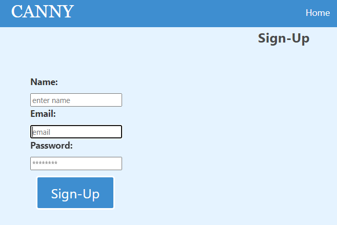
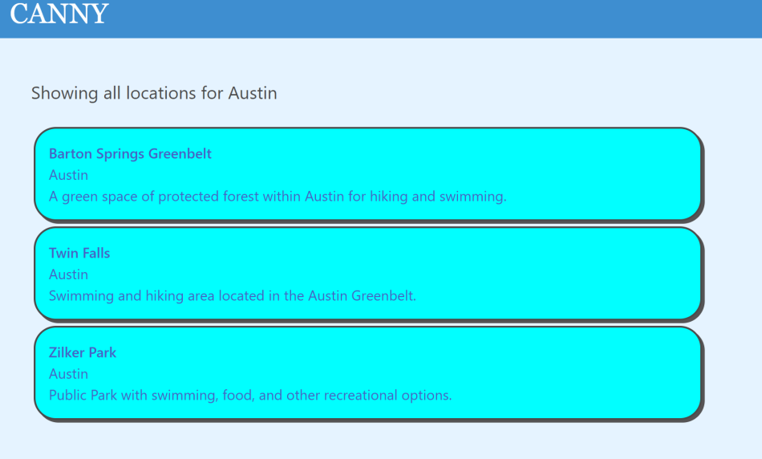
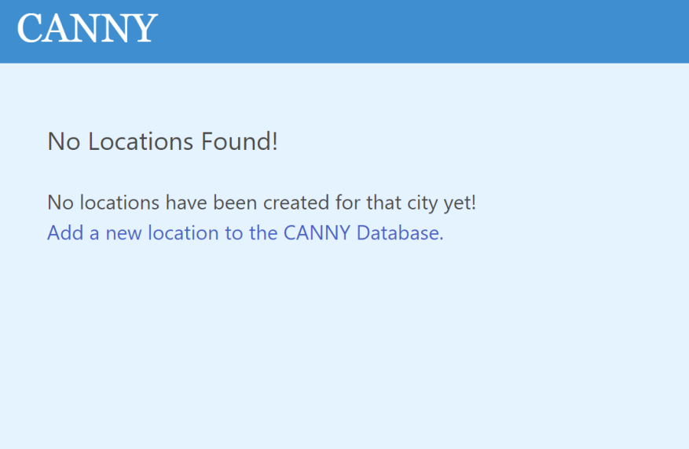
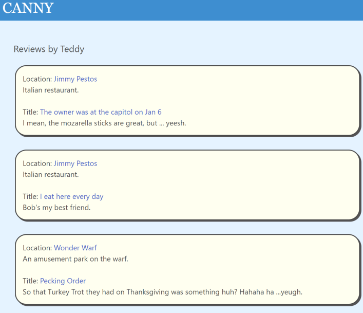

  # CANNY
  
  [](https://opensource.org/licenses/MIT)
  

  ## Description
  
  “CANNY- Cheap And Neat Near You. A crowdsourced app for the canny traveler. Users can create and upload their stories about their visits to attractions, events, businesses- all the fun things to do and visit when traveling. Other users can search for locations that have been logged in their city when they're looking for something fun to do on a budget.”
 
  ## Table of Contents
  - [Usage](#usage)
  - [Contributing](#contributing)
  - [Screenshots](#screenshots)
  - [Links](#links)
  - [Questions](#questions)
  


  ## Usage
  
  Using the app simply requires going to https://canny.herokuapp.com/ and using the navbar to search for CANNY locations. Or if you sign up and are logged in, you can create new locations and add reviews to any location which will be visible to all app users.
 
  ## Contributing
 
  If you would like to contribute to this repository, follow these instructions: 
  
  This repository is open to the public to access, please feel free to comment.

  You can contribute to the app simply by using the app to add new locations and reviews.

  ## Screenshots

  ```Sign Up Page```

  

  ```Locations Page```

  

  ```If there are no locations page```

  

  ```Reviews Page```

  
  

  ## Links

  Deployed Application: 
  https://canny.herokuapp.com/

  Repository: 
  https://github.com/CannyCreators/canny


  ## Questions
  Any questions about this project please contact the creators:

  - Check out other repositories by creator aknodedler at: https://github.com/aknodedler

  - Check out other repositories by creator genmla at: https://github.com/genmla

  - Check out other repositories by creator jcgilbert70 at: https://github.com/jcgilbert70
  

  ## License: MIT
  
 
  MIT License Link: https://opensource.org/licenses/MIT

  
